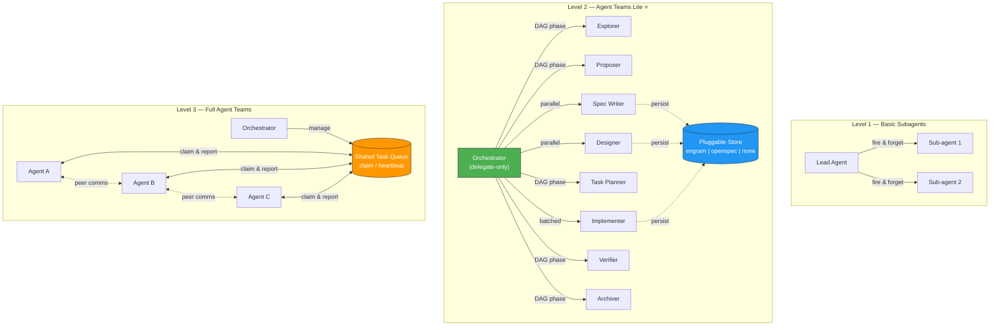

<p align="center">
  <h1 align="center">Agent Teams Lite</h1>
  <p align="center">
    <strong>Agent-Team Orchestration with AI Sub-Agents</strong>
    <br />
    <em>An orchestrator + specialized sub-agents for structured feature development.</em>
    <br />
    <em>Zero dependencies. Pure Markdown. Works everywhere.</em>
  </p>
</p>

<p align="center">
  <a href="#quick-start">Quick Start</a> &bull;
  <a href="#how-it-works">How It Works</a> &bull;
  <a href="#commands">Commands</a> &bull;
  <a href="#installation">Installation</a> &bull;
  <a href="#supported-tools">Supported Tools</a>
</p>

---

## The Problem

AI coding assistants are powerful, but they struggle with complex features:

- **Context overload** — Long conversations lead to compression, lost details, hallucinations
- **No structure** — "Build me dark mode" produces unpredictable results
- **No review gate** — Code gets written before anyone agrees on what to build
- **No memory** — Specs live in chat history that vanishes

## The Solution

**Agent Teams Lite** is an agent-team orchestration pattern where a lightweight coordinator delegates all real work to specialized sub-agents. Each sub-agent starts with fresh context, executes one focused task, and returns a structured result.

```
YOU: "I want to add CSV export to the app"

ORCHESTRATOR (delegate-only, minimal context):
  → launches EXPLORER sub-agent     → returns: codebase analysis
  → shows you summary, you approve
  → launches PROPOSER sub-agent     → returns: proposal artifact
  → launches SPEC WRITER sub-agent  → returns: spec artifact
  → launches DESIGNER sub-agent     → returns: design artifact
  → launches TASK PLANNER sub-agent → returns: tasks artifact
  → shows you everything, you approve
  → launches IMPLEMENTER sub-agent  → returns: code written, tasks checked off
  → launches VERIFIER sub-agent     → returns: verification artifact
  → launches ARCHIVER sub-agent     → returns: change closed
```

**The key insight**: the orchestrator NEVER does phase work directly. It only coordinates sub-agents, tracks state, and synthesizes summaries. This keeps the main thread small and stable.

### Persistence Is Pluggable

The workflow engine is storage-agnostic. Artifacts can be persisted in:

- `engram` (recommended default) — https://github.com/gentleman-programming/engram
- `openspec` (file-based, optional)
- `none` (ephemeral, no persistence)

Default policy is conservative:

- If user explicitly asks for files, use `openspec`
- Else if Engram is available, persist to Engram (recommended)
- Else if project already has `openspec/`, continue using it
- Else use `none` (no writes)

### Quick Modes

Recommended defaults by use case:

```yaml
# Agent-team storage policy
artifact_store:
  mode: engram      # Recommended: persistent, repo-clean
```

```yaml
# Privacy/local-only (no persistence)
artifact_store:
  mode: none
```

```yaml
# File artifacts in project (OpenSpec flow)
artifact_store:
  mode: openspec
```

---

## How It Works

### Where Agent Teams Lite Fits

Agent Teams Lite sits between basic sub-agent patterns and full Agent Teams runtimes:



| Capability | Basic Subagents | Agent Teams Lite | Full Agent Teams |
|---|:---:|:---:|:---:|
| Delegate-only lead | — | ✅ | ✅ |
| DAG-based phase orchestration | — | ✅ | ✅ |
| Parallel phases (spec ∥ design) | — | ✅ | ✅ |
| Structured result envelope | — | ✅ | ✅ |
| Pluggable artifact store | — | ✅ | ✅ |
| Shared task queue with claim/heartbeat | — | — | ✅ |
| Teammate ↔ teammate communication | — | — | ✅ |
| Dynamic work stealing | — | — | ✅ |

### Architecture

```
┌──────────────────────────────────────────────────────────┐
│  ORCHESTRATOR (your main agent — gentleman, default, etc) │
│                                                           │
│  Responsibilities:                                        │
│  • Detect when SDD is needed                              │
│  • Launch sub-agents via Task tool                        │
│  • Show summaries to user                                 │
│  • Ask for approval between phases                        │
│  • Track state: which artifacts exist, what's next        │
│                                                           │
│  Context usage: MINIMAL (only state + summaries)          │
└──────────────┬───────────────────────────────────────────┘
               │
               │ Task(subagent_type: 'general', prompt: 'Read skill...')
               │
    ┌──────────┴──────────────────────────────────────────┐
    │                                                      │
    ▼          ▼          ▼         ▼         ▼           ▼
┌────────┐┌────────┐┌────────┐┌────────┐┌────────┐┌────────┐
│EXPLORE ││PROPOSE ││  SPEC  ││ DESIGN ││ TASKS  ││ APPLY  │ ...
│        ││        ││        ││        ││        ││        │
│ Fresh  ││ Fresh  ││ Fresh  ││ Fresh  ││ Fresh  ││ Fresh  │
│context ││context ││context ││context ││context ││context │
└────────┘└────────┘└────────┘└────────┘└────────┘└────────┘
```

### The Dependency Graph

```
                    proposal
                   (root node)
                       │
         ┌─────────────┴─────────────┐
         │                           │
         ▼                           ▼
      specs                       design
   (requirements                (technical
    + scenarios)                 approach)
         │                           │
         └─────────────┬─────────────┘
                       │
                       ▼
                    tasks
                (implementation
                  checklist)
                       │
                       ▼
                    apply
                (write code)
                       │
                       ▼
                    verify
               (quality gate)
                       │
                       ▼
                   archive
              (merge specs,
               close change)
```

### Sub-Agent Result Contract

Each sub-agent should return a structured payload with variable depth:

```json
{
  "status": "ok | warning | blocked | failed",
  "executive_summary": "short decision-grade summary",
  "detailed_report": "optional long-form analysis when needed",
  "artifacts": [
    {
      "name": "design",
      "store": "engram | openspec | none",
      "ref": "observation-id | file-path | null"
    }
  ],
  "next_recommended": ["tasks"],
  "risks": ["optional risk list"]
}
```

`executive_summary` is intentionally short. `detailed_report` can be as long as needed for complex architecture work.

### Artifact Persistence (Optional)

When `openspec` mode is enabled, a change can produce a self-contained folder:

```
openspec/
├── config.yaml                        ← Project context (stack, conventions)
├── specs/                             ← Source of truth: how the system works TODAY
│   ├── auth/spec.md
│   ├── export/spec.md
│   └── ui/spec.md
└── changes/
    ├── add-csv-export/                ← Active change
    │   ├── proposal.md                ← WHY + SCOPE + APPROACH
    │   ├── specs/                     ← Delta specs (ADDED/MODIFIED/REMOVED)
    │   │   └── export/spec.md
    │   ├── design.md                  ← HOW (architecture decisions)
    │   └── tasks.md                   ← WHAT (implementation checklist)
    └── archive/                       ← Completed changes (audit trail)
        └── 2026-02-16-fix-auth/
```

---

## Quick Start

### 1. Install the skills

```bash
git clone https://github.com/gentleman-programming/agent-teams-lite.git
cd agent-teams-lite
./scripts/install.sh
```

The installer asks which tool you use and copies skills to the right location.

### 2. Add the orchestrator to your agent

See [Installation](#installation) for your specific tool.

### 3. Use it

Open your AI assistant in any project and say:

```
/sdd:init
```

Then start building:

```
/sdd:new add-csv-export
```

Or let it detect automatically — describe a substantial feature and the orchestrator will suggest SDD.

---

## Commands

| Command | What It Does |
|---------|-------------|
| `/sdd:init` | Initialize orchestration context. Creates `openspec/` only when persistence mode resolves to `openspec`. |
| `/sdd:explore <topic>` | Investigate an idea. Reads codebase, compares approaches. No files created. |
| `/sdd:new <name>` | Start a new change by delegating exploration + proposal to sub-agents. |
| `/sdd:continue` | Run the next dependency-ready phase via sub-agent(s). |
| `/sdd:ff <name>` | Fast-forward planning with sub-agents (proposal → specs → design → tasks). |
| `/sdd:apply` | Implement tasks in batches. Checks off items in `tasks.md` as it goes. |
| `/sdd:verify` | Validate implementation against specs. Reports CRITICAL / WARNING / SUGGESTION. |
| `/sdd:archive` | Close a change and persist final state in the active artifact store. |

### Example Flow

```
You: /sdd:new add-dark-mode

AI:  Launching explorer sub-agent...
     ✓ Codebase analyzed. React + Tailwind detected.
     ✓ Current theme: hardcoded light mode in globals.css
     
     Launching proposal sub-agent...
     ✓ proposal.md created
       Intent: Add dark mode toggle with system preference detection
       Scope: Theme context, toggle component, CSS variables
     
     Want me to continue with specs and design? (or review the proposal first)

You: Go ahead

AI:  ✓ specs/ui/spec.md — 3 requirements, 7 scenarios
     ✓ design.md — CSS variables approach, React Context, localStorage
     ✓ tasks.md — 3 phases, 8 tasks
     
     Ready to implement. Run /sdd:apply to start.

You: /sdd:apply

AI:  Implementing Phase 1 (Foundation)...
     ✓ 1.1 Created ThemeContext
     ✓ 1.2 Added CSS custom properties
     ✓ 1.3 Added localStorage persistence
     
     3/8 tasks complete. Continue with Phase 2?
```

---

## The Sub-Agents

Each sub-agent is a SKILL.md file — pure Markdown instructions that any AI assistant can follow.

| Sub-Agent | Skill File | What It Does |
|-----------|-----------|-------------|
| **Init** | `sdd-init/SKILL.md` | Detects project stack, creates `openspec/` structure |
| **Explorer** | `sdd-explore/SKILL.md` | Reads codebase, compares approaches, identifies risks |
| **Proposer** | `sdd-propose/SKILL.md` | Creates `proposal.md` with intent, scope, rollback plan |
| **Spec Writer** | `sdd-spec/SKILL.md` | Writes delta specs (ADDED/MODIFIED/REMOVED) with Given/When/Then |
| **Designer** | `sdd-design/SKILL.md` | Creates `design.md` with architecture decisions and rationale |
| **Task Planner** | `sdd-tasks/SKILL.md` | Breaks down into phased, numbered task checklist |
| **Implementer** | `sdd-apply/SKILL.md` | Writes code following specs and design, marks tasks complete |
| **Verifier** | `sdd-verify/SKILL.md` | Checks completeness, correctness, and coherence |
| **Archiver** | `sdd-archive/SKILL.md` | Merges delta specs into main specs, moves to archive |

---

## Installation

For a full Agent Teams setup, users should configure these two files:

- Claude Code: `~/.claude/CLAUDE.md` (append `examples/claude-code/CLAUDE.md`)
- OpenCode: `~/.config/opencode/opencode.json` (merge `agent.sdd-orchestrator` from `examples/opencode/opencode.json`)

### Claude Code

**1. Copy skills:**

```bash
# Using the install script
./scripts/install.sh  # Choose option 1: Claude Code

# Or manually
cp -r skills/sdd-* ~/.claude/skills/
```

**2. Add orchestrator to `~/.claude/CLAUDE.md`:**

Append the contents of [`examples/claude-code/CLAUDE.md`](examples/claude-code/CLAUDE.md) to your existing `CLAUDE.md`.

This keeps your existing assistant identity and adds SDD as an orchestration overlay.

The orchestrator instructions teach Claude Code to:
- Detect SDD triggers (`/sdd:new`, feature descriptions, etc.)
- Launch sub-agents via the Task tool
- Pass skill file paths so sub-agents read their instructions
- Track state between phases

**3. Verify:**

Open Claude Code and type `/sdd:init` — it should recognize the command.

---

### OpenCode

**1. Copy skills:**

```bash
# Using the install script
./scripts/install.sh  # Choose option 2: OpenCode

# Or manually
cp -r skills/sdd-* ~/.opencode/skills/
```

**2. Add orchestrator agent to `~/.config/opencode/opencode.json`:**

Merge the `agent` block from [`examples/opencode/opencode.json`](examples/opencode/opencode.json) into your existing config.

You can either:
- **Add it to your existing agent** (e.g., append SDD orchestrator instructions to your primary agent's prompt)
- **Create a dedicated agent** (copy the `sdd-orchestrator` agent definition as-is)

Recommended OpenCode setup:
- Keep your everyday assistant (e.g., `gentleman`) as `primary`
- Set `sdd-orchestrator` to `all`
- Select `sdd-orchestrator` only when you want SDD workflows

**3. Verify:**

Open OpenCode and type `/sdd:init` — it should recognize the command.

How to use in OpenCode:
- Start OpenCode in your project: `opencode .`
- Use the agent picker (Tab) and choose `sdd-orchestrator`
- Run SDD commands (`/sdd:init`, `/sdd:new <name>`, `/sdd:continue`, etc.)
- Switch back to your normal agent (Tab) for day-to-day coding

---

### Cursor

**1. Copy skills to project or global:**

```bash
# Global
./scripts/install.sh  # Choose option 3: Cursor

# Or per-project
cp -r skills/sdd-* ./your-project/skills/
```

**2. Add orchestrator to `.cursorrules`:**

Append the contents of [`examples/cursor/.cursorrules`](examples/cursor/.cursorrules) to your project's `.cursorrules` file.

**Note:** Cursor doesn't have a Task tool for true sub-agent delegation. The skills still work — Cursor reads them as instructions — but the orchestrator runs inline rather than delegating to fresh-context sub-agents. For the best sub-agent experience, use Claude Code or OpenCode.

---

### Other Tools (Windsurf, Copilot, Gemini CLI, etc.)

The skills are pure Markdown. Any AI assistant that can read files can use them.

**1. Copy skills** to wherever your tool reads instructions from.

**2. Add orchestrator instructions** to your tool's system prompt or rules file.

**3. Adapt the sub-agent pattern:**
- If your tool has a Task/sub-agent mechanism → use the pattern from `examples/claude-code/CLAUDE.md`
- If not → the orchestrator reads the skills inline (still works, just uses more context)

---

## Why Not Just Use OpenSpec?

[OpenSpec](https://openspec.dev) is great. We took heavy inspiration from it. But:

| | OpenSpec | Agent Teams Lite |
|---|---|---|
| **Dependencies** | Requires `npm install -g @fission-ai/openspec` | Zero. Pure Markdown files. |
| **Sub-agents** | Runs inline (one context window) | True sub-agent delegation (fresh context per phase) |
| **Context usage** | Everything in one conversation | Orchestrator stays lightweight, sub-agents get fresh context |
| **Customization** | Edit YAML schemas + rebuild | Edit Markdown files, instant effect |
| **Tool support** | 20+ tools via CLI | Any tool that can read Markdown (infinite) |
| **Setup** | CLI init + slash commands | Copy files + go |

**The key difference is the sub-agent architecture.** OpenSpec runs everything in a single conversation context. Agent Teams Lite uses the Task tool to spawn fresh-context sub-agents, keeping the orchestrator's context window clean.

This means:
- Less context compression = fewer hallucinations
- Each sub-agent gets focused instructions = better output quality
- Orchestrator stays lightweight = can handle longer feature development sessions

---

## Project Structure

```
agent-teams-lite/
├── README.md                          ← You are here
├── LICENSE
├── skills/                            ← The 9 sub-agent skill files
│   ├── sdd-init/SKILL.md
│   ├── sdd-explore/SKILL.md
│   ├── sdd-propose/SKILL.md
│   ├── sdd-spec/SKILL.md
│   ├── sdd-design/SKILL.md
│   ├── sdd-tasks/SKILL.md
│   ├── sdd-apply/SKILL.md
│   ├── sdd-verify/SKILL.md
│   └── sdd-archive/SKILL.md
├── examples/                          ← Config examples per tool
│   ├── opencode/opencode.json
│   ├── claude-code/CLAUDE.md
│   └── cursor/.cursorrules
└── scripts/
    └── install.sh                     ← Interactive installer
```

---

## Concepts

### Delta Specs

Instead of rewriting entire specs, changes describe what's different:

```markdown
## ADDED Requirements

### Requirement: CSV Export
The system SHALL support exporting data to CSV format.

#### Scenario: Export all observations
- GIVEN the user has observations stored
- WHEN the user requests CSV export
- THEN a CSV file is generated with all observations
- AND column headers match the observation fields

## MODIFIED Requirements

### Requirement: Data Export
The system SHALL support multiple export formats.
(Previously: The system SHALL support JSON export.)
```

When the change is archived, these deltas merge into the main specs automatically.

### RFC 2119 Keywords

Specs use standardized language for requirement strength:

| Keyword | Meaning |
|---------|---------|
| **MUST / SHALL** | Absolute requirement |
| **SHOULD** | Recommended, exceptions may exist |
| **MAY** | Optional |

### The Archive Cycle

```
1. Specs describe current behavior
2. Changes propose modifications (as deltas)
3. Implementation makes changes real
4. Archive merges deltas into specs
5. Specs now describe the new behavior
6. Next change builds on updated specs
```

---

## Contributing

PRs welcome. The skills are Markdown — easy to improve.

**To add a new sub-agent:**
1. Create `skills/sdd-{name}/SKILL.md` following the existing format
2. Add it to the dependency graph in the orchestrator instructions
3. Update the examples and README

**To improve an existing sub-agent:**
1. Edit the `SKILL.md` directly
2. Test by running SDD in a real project
3. Submit PR with before/after examples

---

## License

MIT

---

<p align="center">
  <strong>Built by <a href="https://github.com/gentleman-programming">Gentleman Programming</a></strong>
  <br />
  <em>Because building without a plan is just vibe coding with extra steps.</em>
</p>
