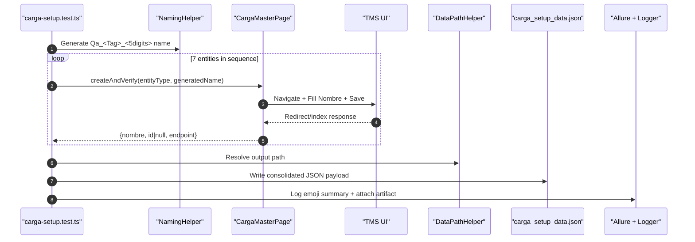

# Design: Carga Master Data Seeding Setup

## Technical Approach

Implement a single metadata-driven Page Object (`CargaMasterPage`) under `configAdmin` to automate seven Carga setup entities that share a name-or-type creation pattern.  
The setup test (`carga-setup.test.ts`) will orchestrate sequential creation, enforce naming convention `Qa_<Tag>_<5digits>`, capture IDs when available, and export a consolidated artifact `carga_setup_data.json` for downstream contract workflows.

The implementation follows existing framework patterns:
- `BasePage` inheritance for reusable interactions and screenshots on error.
- `src/fixtures/base.ts` fixture registration for page injection in tests.
- Winston logging (`logger`/`createLogger`) for structured observability.
- Allure (`allure-playwright`) for epic/feature/story and JSON attachments.
- `DataPathHelper` conventions for deterministic environment-aware data files.

## Architecture Decisions

### Decision: Single CargaMasterPage with Entity Metadata Map

**Choice**: Implement one simplified POM with an internal map per entity (`createPath`, `indexPath`, selectors, optional ID strategy).  
**Alternatives considered**: Create one POM class per entity (7 classes).  
**Rationale**: The seven flows are structurally similar and differ mainly by endpoint/selectors. A metadata approach minimizes duplication and centralizes fallback logic.

### Decision: Sequential Orchestration in One Setup Test

**Choice**: Execute all seven entities in a single `carga-setup.test.ts` scenario, in fixed dependency order.  
**Alternatives considered**: Split into six independent tests with project dependencies.  
**Rationale**: User requirement asks for a full "Data Seeding" script and a single final JSON artifact. A single flow simplifies traceability and artifact consistency.

### Decision: ID Capture as Best-Effort with Explicit Null

**Choice**: Attempt ID extraction from URL first, then DOM/index; persist `null` when unavailable.  
**Alternatives considered**: Fail setup if ID cannot be extracted.  
**Rationale**: Some TMS screens redirect to index without explicit IDs. Blocking on ID would reduce resilience; preserving `nombre` as primary key maintains utility for downstream tests.

### Decision: Standardized Artifact Contract for Downstream Tests

**Choice**: Export one JSON payload with stable keys and metadata (`env`, `createdAt`, entity entries).  
**Alternatives considered**: Write only ad-hoc logs or embed entity data in test-local variables.  
**Rationale**: Contract tests need reusable seeded data across runs and environments; JSON artifact is the existing project convention for inter-test data sharing.

## Data Flow



## File Changes

| File | Action | Description |
|------|--------|-------------|
| `src/modules/configAdmin/pages/CargaMasterPage.ts` | Create | Simplified multi-entity POM with route/selector metadata and resilient save/verify methods |
| `src/fixtures/base.ts` | Modify | Register `cargaMasterPage` fixture type and provider |
| `src/utils/NamingHelper.ts` | Modify | Add Carga-specific naming helper for `Qa_<Tag>_<5digits>` |
| `tests/api-helpers/DataPathHelper.ts` | Modify | Add helper for deterministic `carga_setup_data.json` path |
| `tests/e2e/modules/01-entidades/config/carga-setup.test.ts` | Create | Full sequential setup script with JSON export |
| `package.json` | Modify | Add `test:qa:entity:carga-setup`, `test:demo:entity:carga-setup`, and `run:*` scripts with Allure |

## Interfaces / Contracts

```typescript
export type CargaEntityType =
  | 'unidadMedida'
  | 'categoriaCarga'
  | 'configuracionCarga'
  | 'contenidoCarga'
  | 'temperaturaCarga'
  | 'comercio'
  | 'tipoRampla';

export interface CargaEntitySeed {
  nombre: string;
  id: string | null;
  endpoint: string;
  createdAt: string;
}

export interface CargaSetupData {
  env: 'QA' | 'DEMO';
  createdAt: string;
  entities: Record<CargaEntityType, CargaEntitySeed>;
}
```

## Testing Strategy

| Layer | What to Test | Approach |
|-------|-------------|----------|
| E2E (Config setup) | End-to-end creation of 7 setup entities | Run `carga-setup.test.ts` with fixed sequence and per-step assertions |
| E2E (Artifact contract) | JSON structure and required fields | Validate keys and non-empty `nombre` fields before finishing test |
| Resilience checks | Save/verify fallbacks and screenshot-on-error | Force selector fallback paths where applicable and verify diagnostics |
| Reporting | Visibility for setup consumption | Allure parameters + JSON attachment + logger summary ("listo para contratos") |

## Migration / Rollout

No migration required.  
Rollout order:
1. Land planning artifacts and implementation.
2. Add scripts in `package.json`.
3. Execute setup in QA, then Demo.
4. Confirm downstream tests can read `carga_setup_data.json`.

## Open Questions

- [ ] Confirm final selector set from Confluence for `contenidocarga` and `temperaturacarga` index-based create actions.
- [ ] Confirm canonical output location for `carga_setup_data.json` (root-level filename vs `playwright/.data/` while preserving requested filename).
- [ ] Confirm whether contract tests should fail hard when any `id` is `null` or only require `nombre`.
